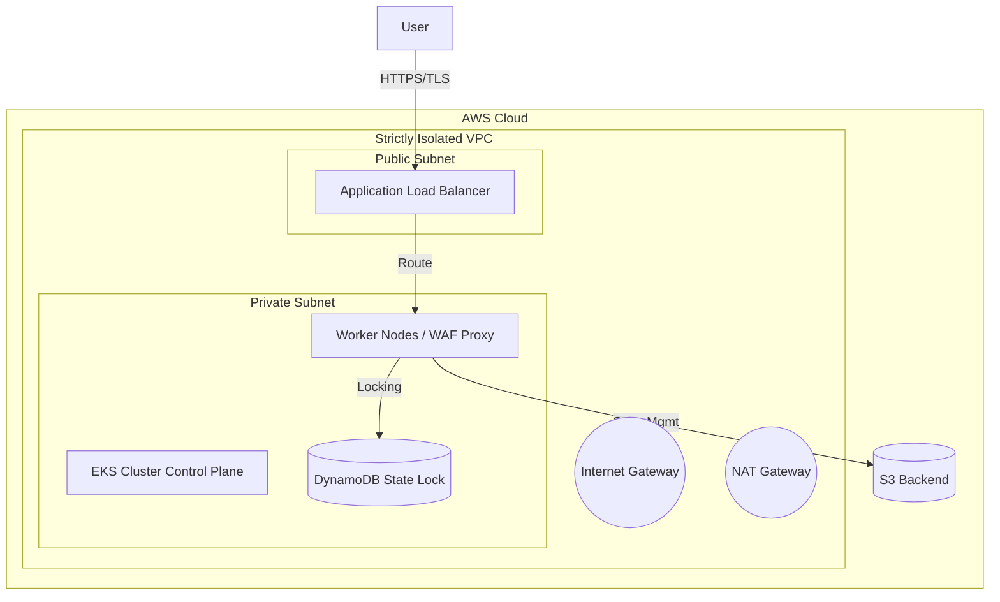

# Cloud-Native Hardened IaC

## Overview
This repository contains a reference architecture for hardened AWS infrastructure using Terraform and Kubernetes (EKS), with a focus on Infrastructure as Code, Cloud-Native Security, and DevSecOps practices.

## Architecture

The infrastructure is designed with a security-first approach, using public/private subnet isolation, strict IAM roles, and automated TLS management.



## Key Features

### 1. Hardened Infrastructure (Terraform)
- **VPC Design:** Segregation of duties with public ingress only for Load Balancers; compute resources reside in private subnets.
- **State Management:** S3 Backend with DynamoDB locking prevents race conditions and ensures state integrity.
- **IAM Policies:** Adherence to the Principle of Least Privilege (PoLP).

### 2. Kubernetes Security (Zero Trust)
- **Network Policies:** Default deny-all ingress/egress rules, explicitly allow-listing traffic between pods.
- **mTLS & Cert-Manager:** Automated certificate rotation and encryption in transit.
- **Resource Management:** Strict CPU/Memory quotas and Horizontal Pod Autoscalers (HPA) to prevent resource exhaustion attacks (DoS).

### 3. CI/CD & DevSecOps
- **Static Analysis:** Integrated `tfsec` and `Checkov` pipelines to block insecure configurations before deployment.
- **Automated Validation:** Workflows for `terraform plan` and linting.

## Deployment Guide

### Prerequisites
- AWS CLI configured with appropriate credentials.
- Terraform v1.5+ installed.
- kubectl and helm installed.

### Step 1: Provision Infrastructure
```bash
cd terraform
terraform init
terraform plan -out=tfplan
terraform apply tfplan
```

### Step 2: Deploy Kubernetes Resources
```bash
aws eks update-kubeconfig --name <cluster-name>
kubectl apply -f k8s/
```
